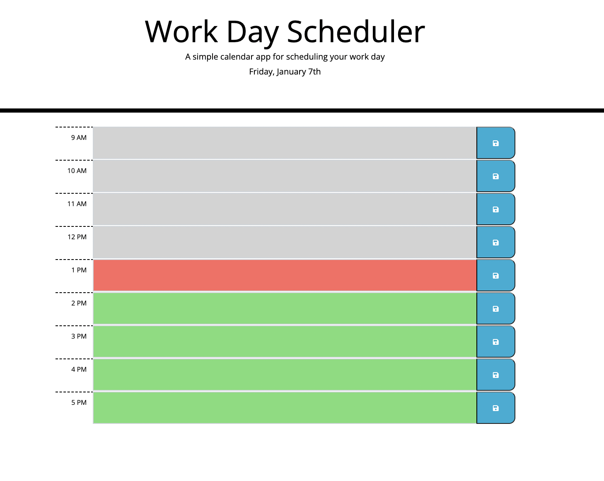

# Work-Day-Schedular

## Purpose
To create a simple work day planner that allows the user to jot down an events that will happen for each hour of the day. The work schedule will present the user in color-coded to indicate whether the current event is in the past, present, or future to let the user know ahead of time.

## Built With
- Html
- Css, Bootstrap
- jQuery

## Assets
A screenshot of the web application's apperance and functionality:

## Website
https://p-her.github.io/work-day-schedular/

## Github Link
https://github.com/p-her/work-day-schedular

